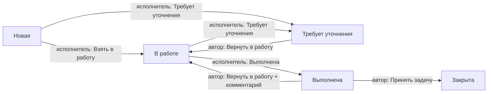

---
{"dg-publish":true,"permalink":"/dokumenty/zadachi-razrabotchiku/","dg-note-properties":{}}
---

Доступ: **Сервис → Задачи**.

---

## Подключение (выполняет администратор)

Признак **Постановщик задач** включается администратором в карточке пользователя. После включения приходит уведомление:

> Вы подключены к подсистеме задач. Использование: Сервис → Задачи

Без этого признака создавать задачи нельзя. В списке постановщик видит **только свои** задачи (где он автор).

| Признак | Что даёт |
|---|---|
| **Постановщик задач** | Создание задач, работа со своими задачами как автор |
| **Исполнитель задач** | Работа с задачами, где пользователь назначен исполнителем |
| **Просмотр всех задач** | Просмотр любых задач **без** возможности менять статус |

---

## Создание задачи

1. Откройте список задач и создайте новую.
2. Заполните:
   - **Наименование**
   - **Описание** (обязательно; после записи обычно не меняется)
   - **Исполнитель** — только из пользователей с признаком «Исполнитель задач»
   - при необходимости: приоритет, тэги, ссылка на проблемный документ
1. Запишите задачу.

**Автор** заполняется автоматически текущим пользователем и не редактируется.

После записи исполнителю уходит уведомление о новой задаче. Статус: **Новая**.

Файлы можно прикрепить после записи задачи.

---

## Статусы

| Статус | Смысл |
|---|---|
| **Новая** | Задача создана, ждёт исполнителя |
| **В работе** | Исполнитель взял задачу или получил её обратно |
| **Требует уточнения** | Исполнитель ждёт ответа автора |
| **Выполнена** | Исполнитель отметил выполнение; нужна реакция автора |
| **Закрыта** | Автор принял результат; задача завершена окончательно |

После **Закрыта** изменения недоступны.

---

## Жизненный цикл (схема)

Циклы уточнения (исполнитель ↔ автор) и доработки после «Выполнена» можно повторять.

---

## Действия постановщика (автора)

### Когда статус «Требует уточнения»

Исполнитель задал вопрос. Доступна кнопка:

- **Вернуть в работу** — задача снова у исполнителя (комментарий не обязателен; при необходимости заполните «Новый комментарий»).

### Когда статус «Выполнена»

Исполнитель сообщил о выполнении. Вам придёт уведомление:

> Задача … выполнена. Подтвердите выполнение или верните на доработку.

Доступны кнопки:

| Кнопка | Результат | Комментарий |
|---|---|---|
| **Принять задачу** | Статус **Закрыта** | Не нужен |
| **Вернуть в работу** | Статус **В работе**, задача снова у исполнителя | **Обязателен** |

### Когда статус «Новая»

Автор может добавить комментарий (поле «Новый комментарий» видно). Смену статуса на этом этапе делает исполнитель («Взять в работу» / «Требует уточнения»).

---

## Что делает исполнитель (для понимания)

| Статус | Кнопки исполнителя |
|---|---|
| **Новая** | **Взять в работу** (без комментария); **Требует уточнения** (с комментарием, если поле доступно) |
| **В работе** | **Требует уточнения**; **Выполнена** (комментарий не обязателен) |

---

## Комментарии и история

- Поле **Новый комментарий** у автора видно в статусах: **Новая**, **Требует уточнения**, **Выполнена**.
- **История** — хронология комментариев (в виде HTML с инициалами автора/исполнителя).
  - В **Новая** история скрыта, пока нет ни одного комментария.
  - При создании новой (ещё не записанной) задачи блок комментариев скрыт.
- После смены статуса с заполненным комментарием запись попадает в историю.

---

## Уведомления

Уведомления приходят **только принимающей стороне** (тому, кому передали задачу), не тому, кто нажал кнопку.

Постановщику (автору), в частности:

| Событие | Смысл |
|---|---|
| Исполнитель запросил уточнение | Нужен ответ / возврат в работу |
| Исполнитель отметил **Выполнена** | Нужно принять или вернуть на доработку |

Исполнителю, в частности: новая задача; возврат автором с уточнением / на доработку; закрытие задачи автором.

Уведомление не отправится, если у получателя снят соответствующий признак (`Постановщик задач` / `Исполнитель задач`).

---

## Ограничения

- После создания реквизиты (описание, наименование, тэги, приоритет, ссылка, исполнитель) обычным пользователям менять нельзя (исключение — роль «Разработка»).
- Дальнейшая работа — комментарии, файлы и смена статусов по правилам выше.
- **Закрыта** — финальный статус, правки недоступны.
- Список постановщика показывает только его задачи как автора.

---

## Краткий чек-лист постановщика

1. Создать задачу → выбрать исполнителя → заполнить описание → записать.  
2. Следить за уведомлениями.  
3. На **Требует уточнения** — ответить комментарием при необходимости и нажать **Вернуть в работу**.  
4. На **Выполнена** — **Принять задачу** или **Вернуть в работу** с обязательным комментарием.  
5. После **Закрыта** задача считается завершённой.
